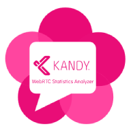

<p align="center">
  
</p>

# Kandy WebRTC Statistics Analyzer
This is a tool for visualizing WebRTC statistics data. It currently works with the data produced by Kandy.js SDK and MobileSDK.

[Live Demo](https://kandy-io.github.io/kandy-webrtc-statistics-analyzer/dist/)

## Run local device

You need to have installed [Node.js](https://nodejs.org/en/download/) on your local device.

1. Install `http-server` package globally via `npm`

```
npm install -g http-server
```

2. Download latest bundle archive of Kandy WebRTC Statistics Analyzer from [there](https://github.com/Kandy-IO/kandy-webrtc-statistics-analyzer/releases/latest/download/kandy-webrtc-statistics-analyzer-dist.zip) 

3. Unzip the archive then open terminal from extracted directory

4. Run already installed `http-server` package

  ```
  http-server ./ -o
  ```

5. Browser will be opened with `http://127.0.0.1:8080/`

## Deploy your own server

1. Download latest bundle archive of Kandy WebRTC Statistics Analyzer from [there](https://github.com/Kandy-IO/kandy-webrtc-statistics-analyzer/releases/latest/download/kandy-webrtc-statistics-analyzer-dist.zip)

2. Upload the files to your server